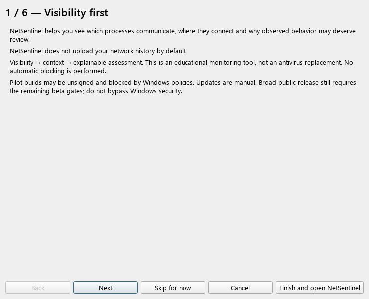
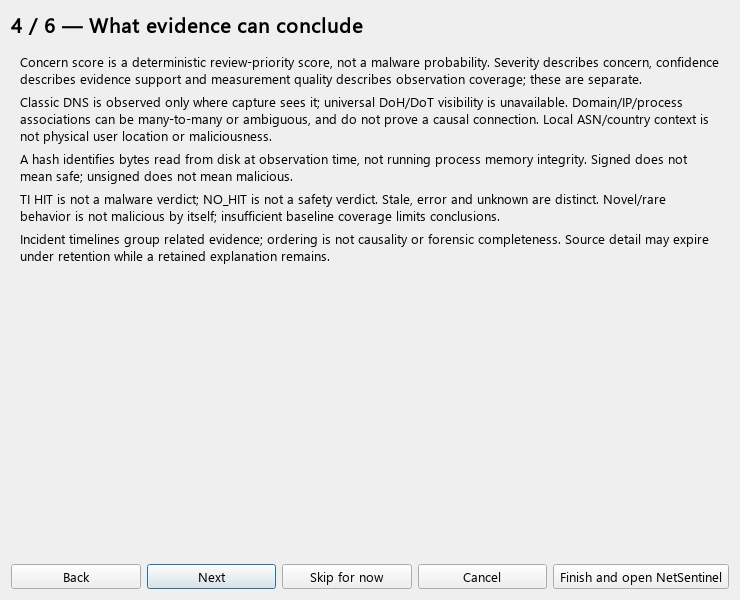
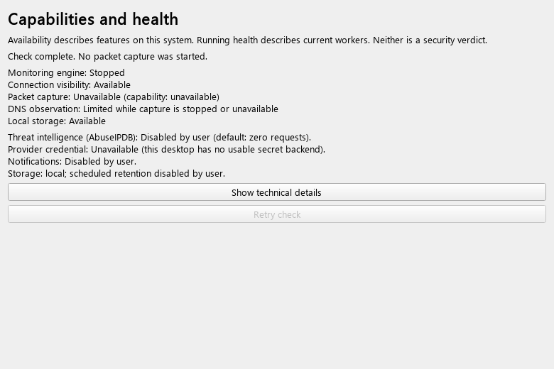
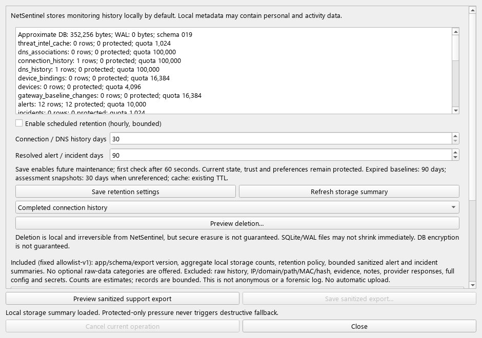
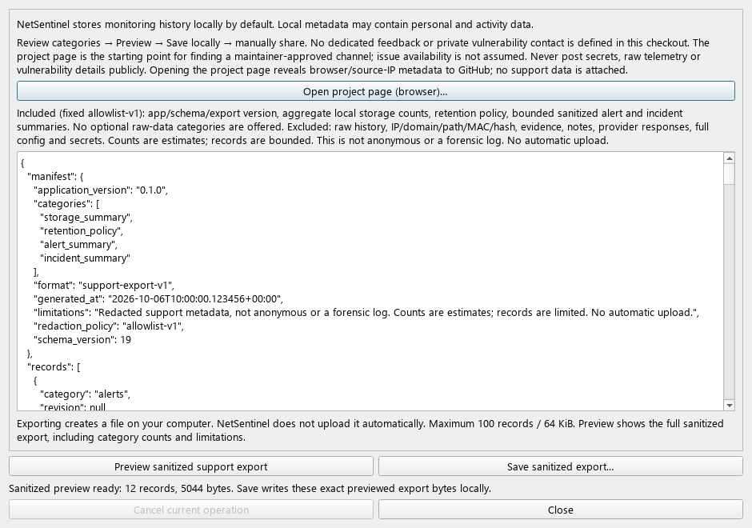

# NS-098 — First-run/feedback polish

Frozen policy, 2026-10-06. TASKS.md acceptance is authoritative: separate
capture/TI consent, no raw-history default export, feedback preview, clear
limitations and consistent release documentation. M17 remains IN PROGRESS;
NS-099 is NOT STARTED. Version stays **0.1.0**, SQLite **019 → 019**. No migration.

## State and startup

`CURRENT_ONBOARDING_VERSION = 1` lives in shared config. Validated integer
`onboarding_completed_version` and `onboarding_dismissed_version` default to 0,
accept 0–10000 and reject booleans. A current or future completed/dismissed
version suppresses startup reminders. Explicit acknowledgement never decreases
a future version. The old `onboarding_completed` boolean is retained solely for
old config/installer compatibility; it cannot hide a materially newer guide.

| State | Behavior |
|---|---|
| Fresh/missing config; no acknowledged guide | Show informational guide before connection engine starts |
| Legacy boolean completion, no version | Start normally; concise status-bar notice points to Help |
| Older acknowledged version after a material guide update | Same nonmodal upgrade notice; no forced modal |
| Current/future acknowledged version | Normal startup, no repeating guide or notice |
| Finish, from any page | Atomically mark current version completed; start core monitoring on first run |
| Skip for now | Atomically mark this version dismissed, not completed; start core monitoring on first run |
| Cancel/X/Esc on first run | Quit without acknowledgement or optional-setting changes; guide appears next run |
| Cancel/X/Esc in Help | Close explanation; running application/settings remain |
| Back/Next | Read-only page navigation; no partial preference write |

Finish and Skip are always explicit choices, available without forcing every
page to be read. Neither grants a permission. They reload current bounded config
before atomic save, preserving settings changed since the guide was opened.
Malformed version fields fall back individually while valid unrelated fields
remain. Existing fail-closed policy disables TI consents if **any** config field
is damaged; this is intentional, not a guide-specific reset. Save failure keeps
the dialog open with sanitized text; no partial config is written.

**Help → First-run & Privacy guide** can always reopen the explanation. It reads
current config rather than startup defaults. Its local shortcuts close the guide
without acknowledgement and open Devices by stable PageId, or the existing TI,
notification, Storage & Privacy and Feedback actions. Reading/finishing the
guide does not restart the engine. The dialog reuses the existing capability
worker, deactivates on close and is deleted after the Help modal ends.

## Six pages and independent permissions

1. **Visibility first** — purpose, local-first, no blocking, unsigned/manual pilot.
2. **Local monitoring and capture** — explicit Devices action, dependency/access
   limits, passive metadata, polling/process/byte boundaries.
3. **Optional external reputation** — actual AbuseIPDB public-IP/manual scope,
   source-IP visibility, authentication, unknown provider retention, credentials.
4. **What evidence can conclude** — assessment, attribution and freshness limits.
5. **Privacy, storage and feedback** — local sensitivity, retention/purge, preview.
6. **Current capabilities** — activity versus availability, optional defaults.

Prominent exact commitment: **NetSentinel does not upload your network history
by default.** Local history can still reveal activity, IP/domain context and
username-bearing paths. Connection/process data, executable metadata, DNS/device
observations, alerts, incidents, baseline, preferences and TI cache remain local.

There are **no guide consent toggles** or shadow capture preference. Passive
capture starts only through the existing Devices **Start passive capture** on an
explicitly selected current network. Npcap installation/access changes remain
manual; no scan, elevation, installer download or security bypass is introduced.

TI consent remains in the existing separate provider/data-type settings screen.
Production registry is AbuseIPDB **IP_REPUTATION / MANUAL_SELECTED**. Consent
Save sends nothing; an explicit selected public-IP lookup is separately required.
That request sends the selected IP and its required provider authentication key;
the provider also sees source IP. No history, paths, command line, file contents,
packet payloads or user notes are sent. No anonymous/retention promise is made.
The current desktop composition has an unavailable secret backend. Its summary
states this without reading secrets or making a test request; custom/test
compositions can truthfully report unchecked readiness. Consent alone cannot
make that backend usable. Notifications remain disabled by default and use
their own existing opt-in Settings dialog.

## Evidence limits and sources

| User-visible boundary | Accepted source |
|---|---|
| Polling may miss short-lived connections; metadata is not process creation/termination telemetry; no per-flow upload/download totals | PRODUCT, SECURITY, TASKS NS-059/060 |
| Classic DNS only where capture observes; no universal DoH/DoT visibility; many-to-many domain/IP/process association is not causality | PRODUCT/SECURITY destination attribution contracts |
| Local ASN/country is context, not physical user location or maliciousness | PRODUCT destination context |
| Hash is observed disk bytes, not memory integrity; signed is not safe, unsigned is not malicious | PRODUCT/SECURITY process evidence contracts |
| TI HIT is not malware, NO_HIT is not safe; stale/error/unknown separate | THREAT_INTELLIGENCE_CONSENT, THREAT_INTELLIGENCE_EVIDENCE |
| Novel/rare behavior alone is not malicious; insufficient baseline coverage limits claims | RISK_EXPLANATION_UI, PRODUCT behavioral baseline |
| Concern score is review priority, not malware probability; severity/confidence/measurement quality separate | RISK_EXPLANATION_UI |
| Incident groups evidence; ordering is not causality/completeness; source may expire while explanation remains | INCIDENT_TIMELINE_UI, STORAGE_PRIVACY |
| No automatic blocking; no antivirus replacement; unsigned/manual pilot | PRODUCT, SECURITY, SIGNING_UPDATE_DISTRIBUTION |

Diagnostics adds a readable summary for engine, connection visibility, capture
activity/capability, DNS observation and local storage, plus actual consent,
credential readiness, notifications and retention preferences. Not checked is
distinct from Unavailable; disabled optional features are neutral **Disabled by
user**, never a fatal security verdict. Technical matrix reasons, privilege,
writer queues and notification counters remain behind an explicit expandable
button. A missing interface overrides a prior successful capture probe; running
capture never falsely makes unavailable DNS storage available. Live capture and
notification snapshots continue updating through existing UI delivery paths.

## Feedback and export

**Help → Feedback & Support** uses the **same StoragePrivacyDialog and NS-095
worker/service/repository**, in an export-only presentation. Opening performs no
summary/export request, writes nothing and opens no browser. It explains:

1. Review fixed included/excluded categories and limitations.
2. Request sanitized preview; Save is disabled until success.
3. Review the **full** bounded sanitized JSON, including manifest, counts and
   records. This improves the old ten-per-category display sample; the engine's
   immutable bytes and export format do not change.
4. Choose a generic `netsentinel-support.json` filename/location and Save locally.
5. Manually share only what you approve through a maintainer-approved channel.

Fixed categories: application/schema/export version and generated export time,
aggregate storage counts/bytes, retention policy and bounded sanitized
alert/incident summaries. No optional raw-data categories exist, so there are no
misleading include-everything checkboxes. Raw connection/DNS history, identifiers,
IP/domain/path/MAC/hash, evidence, notes, provider responses, full config,
credentials and exceptions are excluded. Export is not anonymous or a forensic
record. Format **support-export-v1**, policy **allowlist-v1**, unchanged.

NS-095 retains 50 alerts + 50 incidents, 25-row reads, 100 records / 64KiB,
worker-owned DB/file work, cancellation, same-directory temp/fsync/atomic
replace and cleanup. Save writes exactly the displayed immutable UTF-8 bytes,
without querying again. Cancel/failure before atomic replace preserves an existing
destination and removes temp files. A successful atomic replace is the completion
boundary; cancellation after completion cannot undo a saved file. Re-preview
clears an older preview/Save state before work; failed refresh cannot save stale
data. Errors show sanitized local status, no adapter exception or path.

The verified remote is `https://github.com/ByteGambit/NetSentinel.git`. No dedicated
feedback endpoint, private security address or support URL is defined in this
checkout; issue availability/repository audience is not assumed. UI honestly
states this and offers **Open project page (browser)** as a starting point:
`https://github.com/ByteGambit/NetSentinel`, only after a click, without query,
prefill, attachment, clipboard injection or automatic browser launch. Browser
navigation reveals ordinary browser/source-IP metadata to GitHub. Users must
find an approved channel; never post secrets, raw telemetry or vulnerability
details publicly. This missing owner-defined endpoint is documented, not faked.
No crash uploader, telemetry client, HTTP dependency or background network call
is added. Export authorization is per action, not a permanent upload consent.

## Layout, screenshots and walkthrough

Qt layouts, per-page scroll areas and footer buttons keep essential controls
reachable at 1280×720, 1366×768, 1600×900 and 1920×1080. Tests include 9/16-point
font proxies; guide tests also cover 12-point. This is not native Windows DPI or
screen-reader acceptance. Back/Next/Finish/Skip/Cancel use keyboard focus,
Space/Enter and Esc; action/preview widgets have accessible names/tooltips.
Instructions and states are readable without color.

The five PNGs below show actual widgets with synthetic offline fixtures, not
live sensor evidence. No user history, identity, paths or secrets appear. Renderer:
`python -m tests.fixtures.first_run_feedback_screenshots [output-directory]` with
`QT_QPA_PLATFORM=offscreen`, source/test dependencies and source PYTHONPATH.
The clock/data are fixed; Segoe UI is explicitly loaded only by the renderer if
available because the approved sandbox has no system font catalog. No binary
reproducibility promise across Qt/fonts/platforms is made.

For additional release screenshots, use the existing synthetic selected-detail
fixtures in `tests/gui/test_connections_view.py`, `test_risk_explanation.py` and
`test_incident_timeline.py`: capture Dashboard, Connections with selected context,
Alerts with Risk explanation and Incidents with selected timeline at 1280×720
and 1366×768. Checklist: label test/demo; preserve unknown/expiry/ambiguity text;
no live adapters or current-user config; no real path/IP/domain/MAC/key; visible
selection, navigation and essential footer; inspect the resulting PNG before
publication. These additional release assets are a checklist, not fabricated
screenshots or a public release claim.

Operator usability walkthrough PASS on the synthetic/offscreen build: the six
pages answer local-first/capture/TI/risk questions; Cancel and Back save nothing;
Finish/Skip leave optional features unchanged; Help reopens current settings;
Devices uses stable navigation; Storage/Feedback controls are discoverable;
preview precedes local Save, exact saved bytes match, external navigation requires
a click, no upload occurs; essential controls remain reachable across tested
sizes. This is an agent/operator walkthrough with test fixtures, not research
with an independent novice or native beta acceptance. NS-099 owns that later gate.

Current pilot notes: [RELEASE_NOTES.md](RELEASE_NOTES.md).
Validation and the requested 80-item report: [FIRST_RUN_FEEDBACK_ACCEPTANCE.md](FIRST_RUN_FEEDBACK_ACCEPTANCE.md).
