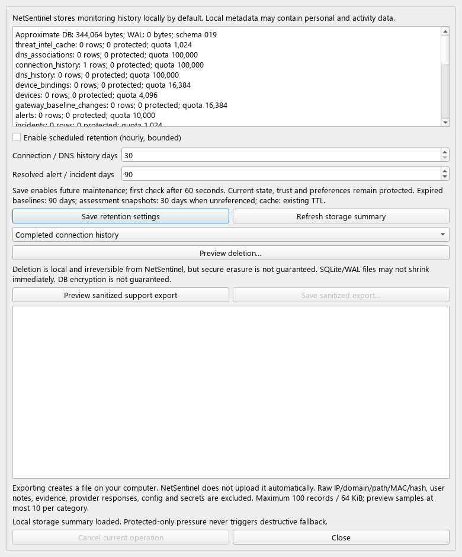

# NS-095 — Storage/privacy controls: acceptance and delivery

Date: 2026-10-06. Initial clean main/HEAD/origin/main: `71eb116`.
Scope: NS-095 only; M17 continues; NS-096 is not started.
Schema **019 → 019**. No migration, no edits to migrations 001–019.
**COMPLETE.** Final offline suite: **3626 passed, 8 deselected** (290.41s).

The pre-code [inventory and policy matrices](STORAGE_PRIVACY.md) are the detailed
store classification/retention/purge/export contract. This report maps the user's
98 delivery points to implementation and evidence. Source availability is lazy:
`source_expired` counters intentionally remain unknown rather than attributing
every missing source to deletion. No raw source scan is added to maintenance.

## Delivery matrix

| # | Requested point | Implemented result / evidence |
|---:|---|---|
| 1 | Exact task | NS-095 — Storage/privacy controls; TASKS.md acceptance unchanged |
| 2 | Completion | COMPLETE; full offline suite and static checks passed |
| 3 | M17 | Continues; only NS-095 status changes |
| 4 | Schema | 019 before/after; summary and migration-chain tests |
| 5 | Migration | None; retryable cleanup requires no durable cursor |
| 6 | Inventory | 21 security tables plus config/logs/metadata and notification memory; STORAGE_PRIVACY.md |
| 7 | Classification | Historical/current/preference/explanation/cache/ephemeral per store in inventory |
| 8 | Typed policy | StorageRetentionPolicy, StoreRetentionRule, Store/StorageScope, typed previews/results |
| 9 | Frequency | Opt-in hourly; central StorageMaintenanceConfig |
| 10 | Startup | Disabled by default; 60s deferred after start/enable; constructor opens no DB |
| 11 | Chunk | 128 telemetry/cache, 64 baseline, 512 assessment/incident physical rows |
| 12 | Budgets | <=2s between chunks/progress handler, <=16 attempts, <=2048 physical deletes |
| 13 | Busy DB | 100ms SQLite and setup lock timeout; bounded rollback/defer tests |
| 14 | Transactions | Separate short BEGIN IMMEDIATE per chunk; owned cascades counted before delete |
| 15 | Active data | Current connections, recent devices, OPEN/ACK alerts/incidents protected |
| 16 | References | Retained alerts pin required assessment parents/exact revisions; active connection/session guard |
| 17 | Incident expiry | Same retained incident/snapshot/link set; lazy SOURCE_EXPIRED_OR_UNAVAILABLE after restart/timeline read |
| 18 | Assessment expiry | Source removal preserves immutable explanation; parent/revision pruning shares alert guards |
| 19 | Alert protection | Only RESOLVED outside 5-minute safety interval eligible; preview/execute rechecks status |
| 20 | Baselines | Central purge removes only >90-day expired; writer quota no longer evicts unexpired scopes |
| 21 | Preferences | Suppression, mark-normal and audit remain untouched, finite/permanent tests |
| 22 | Cache | Reuse NS-085 cleanup/purge and inclusive absolute TTL; no duplicate TTL engine |
| 23 | Notifications | No new durable store; existing active alert watermark/settings retained; NS-094 regressions |
| 24 | Quotas | History/associations 100000, devices/profiles/gateway 4096, bindings/changes 16384, alerts 10000; existing newer bounds retained |
| 25 | Overflow | Oldest eligible first, bounded trim; normal new writes stop at cap instead of silently growing |
| 26 | Protected pressure | Typed CAPACITY_PRESSURE, summary counts, existing persistence failure counters; no active eviction |
| 27 | Cleanup order | Cache → associations → connections → DNS → bindings/devices → gateway history → alerts/incidents → assessments → expired baseline |
| 28 | Determinism | Timestamp + stable primary key; quota tests check oldest selection |
| 29 | Restart | Fresh 60s defer, no constructor cleanup, remaining eligible records are idempotent retry work |
| 30 | Purge scopes | Connections, DNS, cache, resolved alerts/incidents, expired baseline, eligible device history, all eligible history |
| 31 | Confirmation | Estimate, exact scope, protection, reference impact, irreversible warning; explicit Delete button and default Cancel |
| 32 | Cancel before | Preview never deletes; token needed; Cancel UI/test preserves records |
| 33 | Mid-purge Cancel | Current transaction rolls back; earlier committed chunks counted; future chunks stop |
| 34 | Purge protection | Same transaction-time guards as retention; TOCTOU test reopens alert before execution |
| 35 | Partial failure | Per-store merged receipts, failed flag, previous commits survive; no “all cleared” claim |
| 36 | Baseline reset | Not included in generic purge; existing exact-scope reset UI remains authoritative |
| 37 | Profile/trust purge | Not exposed in generic storage purge; existing profile controls retain ownership |
| 38 | Cache purge | NS-085 API, chunked, source snapshots not cascaded |
| 39 | Consent | Not enabled/revoked by cache or history purge; config Save preserves unrelated settings |
| 40 | Suppression | No generic reset; preferences/audit preservation tests |
| 41 | Notification settings | Unchanged by purge; storage settings Save preserves them |
| 42 | Format | Deterministic structured UTF-8 JSON support file |
| 43 | Export version | support-export-v1, redaction allowlist-v1 |
| 44 | Manifest | App/schema versions, generated UTC, categories, limitations and redaction policy |
| 45 | Included | Storage aggregates, retention policy, bounded alert status/severity and incident status/revision |
| 46 | Excluded | Raw telemetry/baseline/TI/preferences/evidence/logs/capabilities/config; aggregate table counts included |
| 47 | IP | Excluded at SQL projection; sentinel tests |
| 48 | Domain | Excluded, no DNS/raw provider reads; sentinel tests |
| 49 | Path | Excluded, no executable/config reads; sentinel tests |
| 50 | MAC | Excluded; no device identity projection |
| 51 | Hash | Excluded; no artifact/source identity projection |
| 52 | Notes | No profile/preference payload reads; no notes/reasons exported |
| 53 | Secrets | Config/credential/env/secret stores never read by exporter |
| 54 | Provider response | No response/payload/evidence query or export |
| 55 | Preview | Sanitized sample, manifest/categories/count/byte limits; Save uses exact immutable previewed content |
| 56 | Preview bound | <=10 samples/category and <=64KiB displayed projection |
| 57 | Export records | <=50 alerts + 50 incidents =100 total |
| 58 | Export bytes | <=65536, checked before file creation; tiny-limit rejection test |
| 59 | Paging | Four LIMIT25 reads at most; no evidence N+1 or unbounded fetchall |
| 60 | Export Cancel | Before write or after temp, no final replacement; Save dialog Cancel writes nothing |
| 61 | Temp cleanup | Same-directory temp removed on normal failure/cancel; tested write failure |
| 62 | Atomic write | flush/fsync/close then os.replace; previous target retained on cancellation/failure |
| 63 | Upload | None: exporter has no HTTP/provider/email/cloud dependency |
| 64 | UI | Settings → Storage & Privacy; menu/lifecycle/offscreen tests |
| 65 | Local wording | Monitoring stored locally; file remains local until manually shared |
| 66 | Purge wording | Local irreversible deletion, scope/estimate/protection/reference consequences |
| 67 | Secure delete | Explicitly not guaranteed; no VACUUM or secure-erasure claim |
| 68 | Encryption | Explicitly not guaranteed |
| 69 | Diagnostics | Worker failures/rejected commands, cleanup physical counts, pressure and approximate DB/WAL sizes |
| 70 | Diagnostic privacy | Stable statuses and aggregate counts only; raw SQL/path/error/source excluded |
| 71 | Coordinator | One portable application worker; Qt polls bounded Future; component writer ownership retained |
| 72 | Serialization | One pending OR active op, queue capacity1 reservation; conflicting operations rejected |
| 73 | Shutdown | Event cancellation + <=2s join, actual stop result participates in ApplicationLifecycle |
| 74 | Time tests | UTC requirement, +/-1µs cutoff, exact cache expiry, fake budget clock |
| 75 | Size tests | At/over quota, physical parent-child budget, export byte/record bounds and admission caps |
| 76 | Reference tests | Actual incident/assessment source removal, immutable snapshots and timeline read |
| 77 | Restart tests | Source state survives SQLite reopen; scheduler defer/no backlog |
| 78 | Busy tests | Write lock and migration/setup lock bounded timeout and recovery |
| 79 | Purge tests | Confirmed/token-bound scope, Cancel, TOCTOU, mid-run cancellation, unaffected trust/preferences |
| 80 | Export tests | Allowlist sentinels, corrupt enum, metadata/versions, records/bytes/pages, atomic write/cancel/failure |
| 81 | UI tests | Summary/settings, Cancel, confirmation, preview/save, off-Qt I/O, shell/shutdown |
| 82 | Added files | Domain/storage, application service/worker, SQLite maintenance/guards, Qt dialog; fixture and three test files; policy/report/synthetic screenshot |
| 83 | Modified files | ports/bootstrap/config/app/menu, existing SQLite writer/retention guards; PRODUCT/SECURITY/ARCHITECTURE/TASKS/ROADMAP and three existing regression tests |
| 84 | Tests | 83 new cases; three regression expectations changed for current-state protection/physical row charging |
| 85 | Commands | Exact commands and runtime explanation below |
| 86 | Targeted | New-only 83 passed; dependency-targeted 487 passed; final changed-path targeted 221 passed |
| 87 | Full pytest | 3626 passed, 8 deselected, existing warning only; 290.41s |
| 88 | Ruff | All checks passed, src/tests |
| 89 | Configured mypy | Passed, 35 source files |
| 90 | Direct mypy | Passed, 16 changed modules |
| 91 | Diff check | git diff --check passed |
| 92 | Migration chain | Included in 487 dependency tests and full suite; immutable 001–019 files verified by Git |
| 93 | TASKS update | Only NS-095 COMPLETE after checks; acceptance/dependencies/non-goals unchanged |
| 94 | Docs | STORAGE_PRIVACY.md and this report; PRODUCT/SECURITY/ARCHITECTURE/ROADMAP current-state text |
| 95 | Commit | feat: add storage and privacy controls; hash reported in final chat |
| 96 | Push | Normal origin main push; result reported in final chat |
| 97 | NS-096 | Not started; no installer, tagging, release, new branch or scope expansion |
| 98 | Working tree | Final clean status and HEAD/origin match verified after commit/push |

## Validation commands and environment

The requested `.venv\Scripts\python.exe` was tried first. Windows Application
Control blocked `_sqlite3` and `_ctypes` DLLs, including outside the sandbox.
No OS security setting/runtime file was changed. The desktop's bundled Python
has the **same CPython 3.12.14 / Windows x64** version and loads the repository's
existing venv packages via PYTHONPATH. All pytest/mypy results below use that
runtime. Ruff works under the requested venv interpreter. No live tests were run.

```powershell
$env:PYTHONPATH = "$PWD\src;$PWD\.venv\Lib\site-packages"
$runtimePython = 'C:\Users\berke\.cache\codex-runtimes\codex-primary-runtime\dependencies\python\python.exe'

# New-only, 83 passed:
& $runtimePython -m pytest -q tests/integration/sqlite/test_storage_privacy.py tests/unit/application/test_storage_maintenance.py tests/gui/test_storage_privacy.py

# Dependency-targeted, 487 passed before the final admission/lock refinements:
& $runtimePython -m pytest -q tests/integration/sqlite/test_storage_privacy.py tests/unit/application/test_storage_maintenance.py tests/gui/test_storage_privacy.py tests/integration/sqlite/test_behavior_baselines.py tests/integration/sqlite/test_risk_assessments.py tests/integration/sqlite/test_incident_persistence.py tests/integration/sqlite/test_incident_timeline.py tests/integration/sqlite/test_retention.py tests/integration/sqlite/test_dns_repository.py tests/integration/sqlite/test_threat_intel_cache.py tests/integration/sqlite/test_vlan_repository.py tests/integration/sqlite/test_device_repository.py tests/integration/sqlite/test_gateway_baseline_repository.py tests/integration/sqlite/test_alert_repository.py tests/integration/test_desktop_notifications.py tests/gui/test_desktop_notifications.py tests/gui/test_app_lifecycle.py tests/integration/sqlite/test_migrations.py

# Final changed paths, 221 passed:
& $runtimePython -m pytest -q tests/integration/sqlite/test_storage_privacy.py tests/unit/application/test_storage_maintenance.py tests/gui/test_storage_privacy.py tests/integration/sqlite/test_risk_assessments.py tests/integration/sqlite/test_dns_association_persistence.py tests/integration/sqlite/test_connection_repository.py tests/integration/sqlite/test_dns_repository.py

& $runtimePython -m pytest -q
.\.venv\Scripts\python.exe -m ruff check src tests
& $runtimePython -m mypy
& $runtimePython -m mypy src/netsentinel/domain/storage_privacy.py src/netsentinel/application/services/storage_privacy.py src/netsentinel/application/services/storage_worker.py src/netsentinel/infrastructure/sqlite/storage_maintenance.py src/netsentinel/infrastructure/sqlite/retention_guards.py src/netsentinel/infrastructure/sqlite/database.py src/netsentinel/presentation/widgets/storage_privacy.py src/netsentinel/bootstrap.py src/netsentinel/presentation/app.py src/netsentinel/infrastructure/sqlite/assessment_repository.py src/netsentinel/infrastructure/sqlite/behavior_baselines.py src/netsentinel/infrastructure/sqlite/repositories.py src/netsentinel/infrastructure/sqlite/vlan_repository.py src/netsentinel/infrastructure/sqlite/alert_repository.py src/netsentinel/infrastructure/sqlite/dns_repository.py src/netsentinel/infrastructure/sqlite/dns_association_repository.py
git diff --check
```

Initial full run used test functions collected before two fixture/physical-chunk
expectations were corrected: 3619 passed /2 failed /8 deselected. The changed-path
221-test run passes with those corrections; final full run verifies current files.
The only observed warning is the existing Scapy/cryptography FFDH deprecation.

## UI review

Synthetic offscreen screenshot inspected; no real user data. The sandbox exposes
zero system font families, so Segoe UI was explicitly loaded **for this rendering
only**. This is layout evidence, not native Windows manual acceptance. Widgets
remain scrollable at smaller heights; summary/preview text is plain and read-only.



## Final verification

Final current-source offline suite: **3626 passed / 8 deselected**, **290.41s**.
Ruff clean; configured mypy **35 files**; direct mypy **16 modules**; diff check
clean. New-only **83 passed**, final changed-path target **221 passed**. Schema
files 001–019 have no Git diff; migration regressions pass in the full suite.
M17 continues; NS-096 remains planned and was not started. Commit message is
`feat: add storage and privacy controls`; the actual commit hash, normal push
result, HEAD/origin match and clean working tree are reported in the final chat
after Git delivery (a commit cannot embed its own hash in this report).
